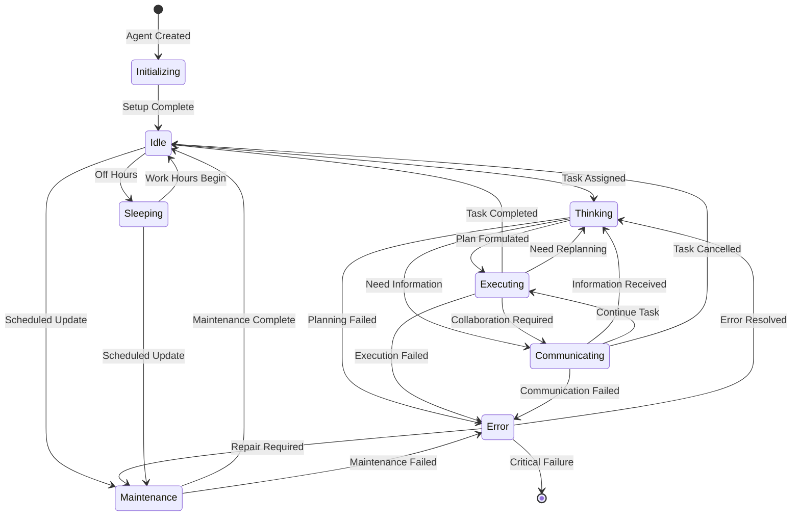
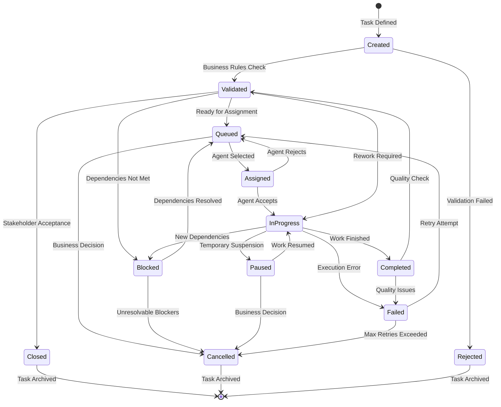
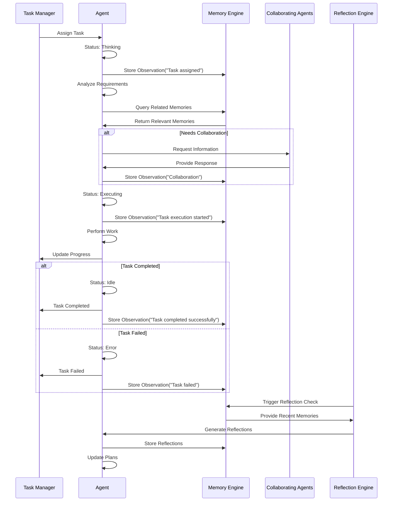
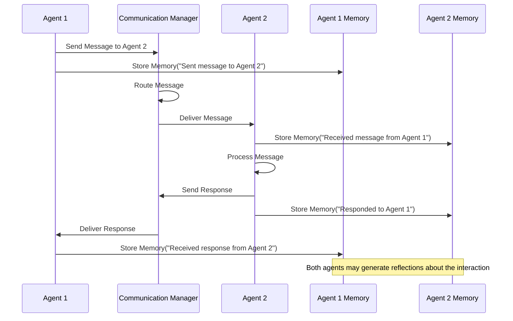
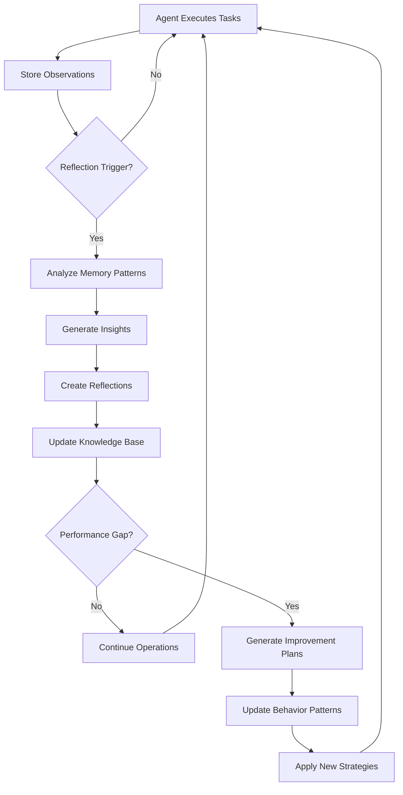
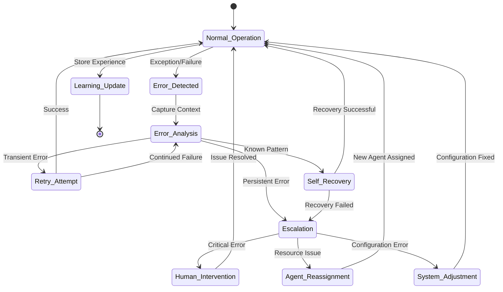

# Agent Factory Smallville Dashboard - Domain Analysis

## 1. Executive Summary

This domain analysis examines the Agent Factory Smallville Dashboard from a business and operational perspective, defining the core entities, their relationships, behavior patterns, and business processes that govern the logistics AI agent ecosystem at ITEM company.

The analysis is structured around five core domains:
1. **Agent Entities** - The autonomous AI workers and their characteristics
2. **Task Management** - The work assignment and execution lifecycle
3. **Communication System** - Inter-agent message exchange and collaboration
4. **Memory & Learning** - Knowledge acquisition, retention, and reflection mechanisms
5. **Spatial & Operational Context** - Physical and logical work environments

## 2. Agent Entity Domain

### 2.1 Agent Entity Definition

An **Agent** in the ITEM logistics ecosystem represents an autonomous AI worker with specialized capabilities, operating within defined boundaries and responsibilities. Each agent embodies both functional capabilities and behavioral characteristics that mirror human worker patterns.

```typescript
// Core Agent Entity
interface Agent {
  // Identity & Classification
  id: string;                    // Unique identifier
  name: string;                  // Human-readable name
  type: AgentType;              // Functional classification
  role: string;                 // Specific job title/responsibility
  department: Department;        // Organizational unit
  
  // Operational State
  status: AgentStatus;          // Current operational state
  statusHistory: StatusChange[]; // Historical state transitions
  
  // Capabilities & Skills
  capabilities: Capability[];    // What the agent can do
  skillLevel: SkillMatrix;      // Proficiency in each capability
  learningRate: number;         // Rate of skill improvement
  
  // Physical & Virtual Presence
  location: Location;           // Current position in space
  homeBase: Location;          // Default/rest location
  operationalZones: Zone[];     // Authorized work areas
  
  // Work Assignment
  currentTask: Task | null;     // Active work assignment
  taskQueue: Task[];           // Pending work assignments
  workCapacity: number;        // Maximum concurrent tasks
  
  // Social & Communication
  communicationStyle: CommunicationStyle;
  collaborationPreferences: CollaborationPrefs;
  trustNetwork: TrustRelationship[];
  
  // Memory & Learning
  memories: Memory[];          // Stored experiences
  memoryCapacity: number;      // Maximum memory retention
  knowledgeBase: KnowledgeItem[];
  
  // Performance & Metrics
  performanceMetrics: PerformanceData;
  reliability: ReliabilityScore;
  efficiency: EfficiencyMetrics;
  
  // Temporal Patterns
  workSchedule: Schedule;       // Operating hours and patterns
  energyLevel: EnergyPattern;   // Performance variation over time
  maintenanceSchedule: MaintenanceWindow[];
  
  // Metadata
  createdAt: Date;
  lastActiveAt: Date;
  configurationVersion: string;
}
```

### 2.2 Agent Type Classification

#### 2.2.1 Warehouse Operations Agents

**Inventory Manager**
- **Primary Function**: Monitor, track, and optimize inventory levels
- **Key Capabilities**: Stock counting, demand forecasting, reorder point calculation
- **Decision Authority**: Autonomous reordering up to $10K, escalation beyond
- **Interaction Pattern**: High frequency with Transport Coordinators, periodic with Data Analysts
- **Performance Metrics**: Inventory accuracy, stockout prevention, carrying cost optimization

**Quality Control Inspector**
- **Primary Function**: Ensure product quality and compliance standards
- **Key Capabilities**: Visual inspection, compliance checking, defect classification
- **Decision Authority**: Accept/reject shipments, initiate quality holds
- **Interaction Pattern**: Collaboration with Warehouse Supervisors, escalation to managers
- **Performance Metrics**: Defect detection rate, false positive rate, inspection throughput

**Picking Coordinator**
- **Primary Function**: Optimize picking routes and batch orders
- **Key Capabilities**: Route optimization, order batching, resource allocation
- **Decision Authority**: Modify picking sequences, reassign work
- **Interaction Pattern**: Real-time coordination with Warehouse Workers
- **Performance Metrics**: Pick efficiency, order accuracy, travel time optimization

#### 2.2.2 Transportation & Logistics Agents

**Route Optimizer**
- **Primary Function**: Calculate optimal delivery routes and schedules
- **Key Capabilities**: Traffic analysis, route calculation, fuel optimization
- **Decision Authority**: Route modifications, delivery time adjustments
- **Interaction Pattern**: Data exchange with external traffic APIs, coordination with dispatchers
- **Performance Metrics**: Fuel efficiency, on-time delivery rate, route optimization percentage

**Fleet Manager**
- **Primary Function**: Monitor vehicle performance and maintenance needs
- **Key Capabilities**: Vehicle tracking, maintenance scheduling, performance analysis
- **Decision Authority**: Maintenance authorization, vehicle assignment
- **Interaction Pattern**: Integration with telematics systems, coordination with maintenance teams
- **Performance Metrics**: Vehicle uptime, maintenance cost efficiency, fuel consumption

**Dispatch Coordinator**
- **Primary Function**: Assign and schedule deliveries across available resources
- **Key Capabilities**: Resource allocation, schedule optimization, priority management
- **Decision Authority**: Delivery assignments, priority adjustments
- **Interaction Pattern**: Constant communication with drivers and customers
- **Performance Metrics**: Resource utilization, customer satisfaction, schedule adherence

#### 2.2.3 Customer Service Agents

**Inquiry Handler**
- **Primary Function**: Process customer questions and information requests
- **Key Capabilities**: Natural language processing, knowledge base search, ticket routing
- **Decision Authority**: Standard response authorization, escalation protocols
- **Interaction Pattern**: Direct customer communication, collaboration with specialists
- **Performance Metrics**: Response time, resolution rate, customer satisfaction

**Issue Resolver**
- **Primary Function**: Investigate and resolve customer problems
- **Key Capabilities**: Problem analysis, solution generation, cross-system investigation
- **Decision Authority**: Resolution implementation, compensation approval up to limits
- **Interaction Pattern**: Multi-departmental coordination, customer follow-up
- **Performance Metrics**: Resolution time, first-contact resolution, repeat issue rate

#### 2.2.4 Data & Analytics Agents

**Performance Analyst**
- **Primary Function**: Monitor operational KPIs and identify trends
- **Key Capabilities**: Data aggregation, statistical analysis, trend identification
- **Decision Authority**: Report generation, alert triggering
- **Interaction Pattern**: Data consumption from all systems, insights delivery to management
- **Performance Metrics**: Insight accuracy, reporting timeliness, actionability of recommendations

**Predictive Modeler**
- **Primary Function**: Forecast future conditions and recommend proactive actions
- **Key Capabilities**: Machine learning, pattern recognition, scenario modeling
- **Decision Authority**: Model parameter adjustment, forecast publication
- **Interaction Pattern**: Data scientist collaboration, cross-functional insights sharing
- **Performance Metrics**: Forecast accuracy, model performance, business impact

#### 2.2.5 Development & System Agents

**Code Reviewer**
- **Primary Function**: Analyze code quality and enforce standards
- **Key Capabilities**: Static analysis, pattern detection, documentation review
- **Decision Authority**: Approval/rejection of code changes, standard enforcement
- **Interaction Pattern**: Developer collaboration, CI/CD system integration
- **Performance Metrics**: Review thoroughness, bug detection rate, review turnaround time

**System Monitor**
- **Primary Function**: Oversee system health and performance
- **Key Capabilities**: Log analysis, performance monitoring, anomaly detection
- **Decision Authority**: Alert generation, automated remediation within bounds
- **Interaction Pattern**: System integration, on-call engineer notification
- **Performance Metrics**: Uptime improvement, incident detection time, false alert rate

### 2.3 Agent State Machine



### 2.4 Agent Behavioral Patterns

#### 2.4.1 Work Rhythm Patterns

**Early Bird Pattern (06:00-14:00)**
- Transportation agents, warehouse opening shift
- High energy in morning hours (06:00-10:00)
- Peak performance: 08:00-11:00
- Gradual decline after 12:00

**Standard Business Pattern (09:00-17:00)**
- Customer service, administrative, development agents
- Steady performance throughout core hours
- Peak performance: 10:00-12:00, 14:00-16:00
- Energy dips during lunch (12:00-13:00)

**Extended Operations Pattern (07:00-19:00)**
- Data analysis, system monitoring agents
- Multiple performance peaks throughout day
- Adaptive scheduling based on workload
- Sustained performance across 12-hour window

**Night Shift Pattern (22:00-06:00)**
- System maintenance, batch processing agents
- Peak performance: 23:00-03:00
- Reduced communication (minimal human overlap)
- Focus on automated processes

#### 2.4.2 Communication Patterns

**Broadcast Communicators**
- System monitors, performance analysts
- Send regular status updates to multiple recipients
- Low frequency, high information density
- Scheduled communication windows

**Collaborative Communicators**
- Customer service, warehouse coordinators
- High frequency, peer-to-peer communication
- Real-time information exchange
- Context-aware message targeting

**Hierarchical Communicators**
- Quality control, compliance agents
- Structured escalation patterns
- Formal communication protocols
- Documentation-heavy interactions

#### 2.4.3 Decision-Making Patterns

**Analytical Decision Making**
- Data analysts, route optimizers
- Extensive information gathering
- Multiple scenario evaluation
- Delayed but high-quality decisions

**Rapid Response Decision Making**
- Customer service, dispatch coordinators
- Quick pattern recognition
- Standard operating procedure following
- Fast decisions with acceptable accuracy

**Consensus Building Decision Making**
- Development team agents, project managers
- Multiple stakeholder input
- Collaborative solution development
- Longer timeline, higher buy-in

## 3. Task Entity Domain

### 3.1 Task Entity Definition

A **Task** represents a discrete unit of work that can be assigned to and executed by an agent. Tasks encapsulate both the work to be done and the business context surrounding that work.

```typescript
interface Task {
  // Identity & Classification
  id: string;                   // Unique identifier
  title: string;                // Human-readable name
  description: string;          // Detailed work description
  type: TaskType;              // Functional classification
  category: TaskCategory;       // Business domain grouping
  
  // Business Context
  businessValue: number;        // Relative business importance
  urgency: UrgencyLevel;       // Time sensitivity
  complexity: ComplexityLevel; // Execution difficulty
  riskLevel: RiskLevel;        // Potential impact of failure
  
  // Assignment & Ownership
  assignedTo: string | null;    // Current agent assignment
  createdBy: string;           // Originating entity
  requestedBy: string;         // Business requestor
  approvedBy: string | null;    // Authorization entity
  
  // Dependencies & Relationships
  dependencies: TaskDependency[]; // Prerequisite tasks
  blockers: TaskBlocker[];      // Current impediments
  subtasks: string[];          // Decomposed work items
  parentTask: string | null;    // Hierarchical relationship
  relatedTasks: string[];      // Associated work items
  
  // Resource Requirements
  requiredCapabilities: Capability[]; // Skills needed
  estimatedEffort: EffortEstimate;   // Expected work
  resourceRequirements: Resource[];   // Tools, systems needed
  
  // Temporal Constraints
  createdAt: Date;             // Task creation time
  requestedStartDate: Date;    // Preferred start
  requestedDueDate: Date;      // Business deadline
  estimatedDuration: number;   // Expected completion time
  actualStartDate: Date | null; // Actual start
  actualDuration: number | null; // Actual time spent
  
  // Execution State
  status: TaskStatus;          // Current lifecycle state
  progress: ProgressMetrics;   // Completion tracking
  qualityChecks: QualityGate[]; // Validation requirements
  
  // Business Rules
  retryPolicy: RetryPolicy;    // Failure handling
  escalationRules: EscalationRule[]; // Escalation triggers
  complianceRequirements: ComplianceRule[]; // Regulatory needs
  
  // Results & Outcomes
  deliverables: Deliverable[]; // Expected outputs
  actualResults: TaskResult[]; // Actual outputs
  qualityScore: QualityScore; // Result assessment
  
  // Communication & Collaboration
  collaborators: string[];     // Additional involved agents
  communications: MessageThread[]; // Task-related discussions
  stakeholders: Stakeholder[]; // Interested parties
  
  // Learning & Improvement
  lessonsLearned: LessonLearned[]; // Post-completion insights
  improvements: Improvement[];  // Process enhancement opportunities
  
  // Metadata
  tags: string[];              // Categorization tags
  metadata: Record<string, any>; // Extensible properties
  version: string;             // Task definition version
}
```

### 3.2 Task Lifecycle State Machine



### 3.3 Task Type Classification

#### 3.3.1 Operational Tasks

**Inventory Management Tasks**
- **Stock Counts**: Physical verification of inventory quantities
- **Reorder Processing**: Automated purchase order generation
- **Cycle Counts**: Regular accuracy verification
- **Exception Handling**: Addressing inventory discrepancies
- **Forecast Updates**: Demand prediction model maintenance

**Quality Control Tasks**
- **Incoming Inspection**: Vendor shipment quality verification
- **Process Audits**: Operational procedure compliance checking
- **Customer Complaint Investigation**: Quality issue root cause analysis
- **Corrective Action Implementation**: Quality improvement execution
- **Supplier Quality Assessment**: Vendor performance evaluation

#### 3.3.2 Customer Service Tasks

**Inquiry Response Tasks**
- **Order Status Requests**: Customer shipment information
- **Product Information**: Catalog and specification inquiries
- **Account Management**: Customer record updates
- **Billing Questions**: Invoice and payment inquiries
- **Technical Support**: Product usage assistance

**Issue Resolution Tasks**
- **Delivery Problems**: Addressing shipping issues
- **Product Defects**: Managing quality complaints
- **Billing Disputes**: Resolving payment conflicts
- **Service Failures**: Addressing service level breaches
- **Escalation Management**: Complex problem resolution

#### 3.3.3 Transportation Tasks

**Route Planning Tasks**
- **Daily Route Optimization**: Delivery sequence planning
- **Emergency Rerouting**: Dynamic route adjustments
- **Load Planning**: Vehicle capacity optimization
- **Driver Assignment**: Resource allocation to routes
- **Schedule Coordination**: Multi-stop timing management

**Fleet Management Tasks**
- **Vehicle Maintenance Scheduling**: Preventive maintenance planning
- **Fuel Optimization**: Cost-effective fuel management
- **Driver Performance Monitoring**: Safety and efficiency tracking
- **Compliance Reporting**: Regulatory requirement fulfillment
- **Asset Utilization Analysis**: Fleet efficiency assessment

#### 3.3.4 Data Analysis Tasks

**Performance Monitoring Tasks**
- **KPI Dashboard Updates**: Real-time metric calculation
- **Trend Analysis**: Historical pattern identification
- **Exception Reporting**: Threshold breach notifications
- **Comparative Analysis**: Benchmark performance assessment
- **Predictive Alerts**: Early warning system management

**Strategic Analysis Tasks**
- **Business Intelligence Reports**: Executive decision support
- **Market Analysis**: Competitive positioning insights
- **Operational Optimization**: Process improvement identification
- **Cost Analysis**: Financial efficiency assessment
- **Risk Assessment**: Business threat evaluation

### 3.4 Task Priority & Scheduling Framework

#### 3.4.1 Priority Calculation

```typescript
interface TaskPriority {
  businessValue: number;      // 1-10 scale
  urgency: number;           // 1-10 scale
  effortRequired: number;    // 1-10 scale (inverse)
  riskOfDelay: number;      // 1-10 scale
  
  // Calculated priority score
  priorityScore: number;     // Weighted combination
  
  // Dynamic adjustments
  timeDecay: number;        // Urgency increase over time
  contextualBoost: number;  // Situational importance
}

// Priority calculation algorithm
function calculatePriority(task: Task): number {
  const base = (task.businessValue * 0.3) + 
               (task.urgency * 0.4) + 
               ((10 - task.effortRequired) * 0.2) + 
               (task.riskOfDelay * 0.1);
  
  const timeAdjustment = calculateTimeDecay(task);
  const contextAdjustment = assessContextualFactors(task);
  
  return Math.min(10, base + timeAdjustment + contextAdjustment);
}
```

#### 3.4.2 Scheduling Algorithms

**First-Come-First-Serve (FCFS)**
- Simple queue-based scheduling
- Used for routine, equal-priority tasks
- Predictable execution order
- No consideration of optimization opportunities

**Shortest-Job-First (SJF)**
- Prioritize tasks with shortest estimated duration
- Maximizes throughput for low-complexity work
- Risk of starvation for complex tasks
- Used during high-volume periods

**Priority-Based Scheduling**
- Execution order based on calculated priority scores
- Preemptive option for critical tasks
- Dynamic re-prioritization capability
- Primary algorithm for business-critical work

**Resource-Aware Scheduling**
- Consider agent capabilities and current load
- Optimize for agent skill utilization
- Minimize context switching costs
- Balance workload across available resources

## 4. Communication & Message Entity Domain

### 4.1 Message Entity Definition

A **Message** represents a communication event between agents, containing both the information payload and the metadata necessary for routing, delivery, and visualization.

```typescript
interface Message {
  // Identity & Routing
  id: string;                  // Unique message identifier
  conversationId: string;      // Thread/conversation grouping
  correlationId: string;       // Request/response correlation
  
  // Participants
  sender: string;              // Originating agent
  recipients: Recipient[];     // Target agents or groups
  carbonCopy: string[];       // Additional recipients
  blindCopy: string[];        // Hidden recipients
  
  // Message Content
  subject: string;            // Message topic
  content: string;            // Primary message body
  contentType: ContentType;   // Text, structured data, etc.
  attachments: Attachment[];  // Supporting materials
  
  // Communication Type & Protocol
  messageType: MessageType;   // Direct, broadcast, multicast
  protocol: CommProtocol;     // HTTP, WebSocket, event bus
  priority: MessagePriority;  // Delivery importance
  deliveryMode: DeliveryMode; // Guaranteed, best-effort, fire-and-forget
  
  // Temporal Aspects
  sentAt: Date;               // Transmission time
  deliveredAt: Date[];        // Per-recipient delivery time
  readAt: Date[];            // Per-recipient read time
  expiresAt: Date;           // Message expiration
  
  // Context & Relationships
  inReplyTo: string;         // Parent message reference
  forwardedFrom: string;     // Original message if forwarded
  relatedTasks: string[];    // Associated task IDs
  relatedMemories: string[]; // Connected memory entries
  
  // Business Context
  businessContext: BusinessContext;
  confidentiality: ConfidentialityLevel;
  complianceFlags: ComplianceFlag[];
  
  // Delivery & Error Handling
  deliveryAttempts: DeliveryAttempt[];
  errorConditions: ErrorCondition[];
  retryPolicy: MessageRetryPolicy;
  
  // Visual Representation
  visualization: MessageVisualization;
  displayDuration: number;    // UI display time
  animationStyle: AnimationStyle;
  
  // Metadata
  tags: string[];
  metadata: Record<string, any>;
  version: string;
}
```

### 4.2 Communication Patterns

#### 4.2.1 Direct Communication (Point-to-Point)

**Use Cases:**
- Task assignment and acceptance
- Status updates between collaborating agents
- Information requests and responses
- Error notifications and escalations

**Characteristics:**
- Single sender, single recipient
- Guaranteed delivery required
- Often requires acknowledgment
- May trigger immediate response

**Example Flow:**
```
Inventory Manager → Warehouse Supervisor: "Stock levels critical for Item #12345"
Warehouse Supervisor → Inventory Manager: "Acknowledged. Initiating emergency reorder."
```

#### 4.2.2 Broadcast Communication (One-to-Many)

**Use Cases:**
- System-wide status announcements
- Policy or procedure updates
- Emergency notifications
- Performance metric updates

**Characteristics:**
- Single sender, multiple recipients
- Best-effort delivery acceptable
- No individual acknowledgment expected
- Information sharing focus

**Example Flow:**
```
System Monitor → [All Agents]: "Network maintenance scheduled 02:00-04:00 tonight"
```

#### 4.2.3 Multicast Communication (Group-Based)

**Use Cases:**
- Department-specific announcements
- Team coordination messages
- Functional area updates
- Project-related communications

**Characteristics:**
- Single sender, defined group recipients
- Group membership managed dynamically
- Topic-based or role-based targeting
- Moderate delivery requirements

**Example Flow:**
```
Fleet Manager → [Transportation Agents]: "New route optimization algorithm deployed"
```

#### 4.2.4 Publish-Subscribe Communication

**Use Cases:**
- Event notifications (task completion, status changes)
- Data updates (inventory levels, performance metrics)
- Alert distribution (system errors, threshold breaches)
- Real-time data streaming

**Characteristics:**
- Decoupled sender-receiver relationship
- Topic-based message routing
- Scalable one-to-many distribution
- Asynchronous delivery

**Example Flow:**
```
Task Executor → [Topic: task.completed]: {taskId: "T123", result: "success"}
Performance Analyzer ← [Subscribed to: task.completed]: Processes completion data
Report Generator ← [Subscribed to: task.completed]: Updates dashboard metrics
```

### 4.3 Message Priority & Routing

#### 4.3.1 Priority Classification

**Critical (Priority 1)**
- System errors affecting operations
- Safety-related notifications
- Security breach alerts
- Immediate delivery required (<5 seconds)

**High (Priority 2)**
- Task failures requiring intervention
- Customer escalations
- Resource shortage alerts
- Fast delivery required (<30 seconds)

**Normal (Priority 3)**
- Routine status updates
- Scheduled reports
- Standard task assignments
- Standard delivery (<2 minutes)

**Low (Priority 4)**
- Informational updates
- Background data synchronization
- Non-urgent notifications
- Deferred delivery acceptable (<10 minutes)

#### 4.3.2 Routing Algorithms

**Capability-Based Routing**
- Route messages based on recipient capabilities
- Ensure message reaches agents who can act on it
- Used for task assignments and skill-specific inquiries

**Load-Aware Routing**
- Consider current agent workload when routing
- Distribute communication load evenly
- Prevent message bottlenecks

**Context-Aware Routing**
- Route based on current agent context and location
- Prioritize local or relevant agents
- Reduce communication overhead

**Hierarchical Routing**
- Follow organizational hierarchy for escalations
- Ensure proper authorization levels
- Maintain compliance with business rules

### 4.4 Communication Quality Metrics

```typescript
interface CommunicationMetrics {
  // Delivery Performance
  deliveryRate: number;         // Successfully delivered / sent
  averageDeliveryTime: number;  // Mean delivery latency
  deliveryReliability: number;  // Consistency of delivery times
  
  // Response Patterns
  responseRate: number;         // Messages receiving responses
  averageResponseTime: number;  // Mean response latency
  responseQuality: number;      // Relevance and completeness
  
  // Network Health
  networkLatency: number;       // Communication infrastructure performance
  errorRate: number;           // Failed delivery percentage
  retryFrequency: number;      // Average retries per message
  
  // Business Value
  actionableMessages: number;   // Messages leading to actions
  informationValue: number;    // Usefulness of content
  conversationEfficiency: number; // Information per message
  
  // Agent Behavior
  communicationFrequency: number; // Messages per agent per hour
  collaborationIndex: number;   // Cross-agent interaction measure
  knowledgeSharing: number;     // Information dissemination rate
}
```

## 5. Memory & Learning Entity Domain

### 5.1 Memory System Architecture (Based on Smallville Paper)

The memory system implements the observation → reflection → planning cycle described in the Stanford Generative Agents paper, adapted for logistics operations.

#### 5.1.1 Memory Entity Definition

```typescript
interface Memory {
  // Identity & Classification
  id: string;                   // Unique memory identifier
  agentId: string;             // Owning agent
  type: MemoryType;            // Observation, reflection, plan
  
  // Content & Context
  content: string;             // Natural language description
  structuredData: any;         // Machine-readable data
  importance: number;          // 1-10 relevance score
  
  // Temporal Context
  timestamp: Date;             // When memory was created
  duration: number;            // How long the observed event lasted
  timeContext: TimeContext;    // Time of day, day of week context
  
  // Spatial Context
  location: Location;          // Where the memory occurred
  spatialContext: SpatialContext; // Proximity to other entities
  
  // Relational Context
  relatedAgents: string[];     // Other agents involved
  relatedTasks: string[];      // Associated tasks
  relatedMemories: string[];   // Connected memory entries
  causedBy: string[];         // Causal predecessors
  ledTo: string[];            // Causal consequences
  
  // Semantic Context
  keywords: string[];          // Content keywords
  entities: Entity[];         // Recognized entities (people, places, things)
  emotions: Emotion[];        // Emotional context
  intentions: Intention[];    // Inferred or stated goals
  
  // Learning & Evolution
  accessCount: number;        // How often referenced
  lastAccessed: Date;         // Most recent retrieval
  confidenceLevel: number;    // Certainty in accuracy
  validationStatus: ValidationStatus;
  
  // Retention & Decay
  retentionWeight: number;    // Resistance to forgetting
  decayRate: number;         // Rate of importance decline
  expirationDate: Date;      // Forced deletion date
  
  // Metadata
  tags: string[];
  metadata: Record<string, any>;
  version: string;
}
```

#### 5.1.2 Memory Types

**Observational Memories**
- Direct sensory experiences of the agent
- Task executions, environmental changes, agent interactions
- High detail, factual content
- Foundation for reflection and planning

*Examples:*
- "Completed inventory count for Section A at 10:30 AM - found 15 discrepancies"
- "Received urgent message from Customer Service Agent about order #12345"
- "Collaborated with Transport Coordinator on route optimization for Zone 5"

**Reflective Memories**
- Higher-order thinking about patterns and relationships
- Generated from analyzing multiple observational memories
- Abstract insights and generalizations
- Medium to high importance scores

*Examples:*
- "Inventory discrepancies increase by 23% on Monday mornings, likely due to weekend processing"
- "Collaboration with Maria (Transport Coordinator) is highly effective - 87% successful outcomes"
- "Route optimization tasks take 30% longer during peak traffic hours (8-9 AM, 5-6 PM)"

**Planning Memories**
- Future-oriented intentions and strategies
- Generated from reflections and current observations
- Actionable goals and approaches
- Dynamic, updated as plans evolve

*Examples:*
- "Should proactively schedule inventory counts for Tuesday mornings to avoid Monday issues"
- "Will prioritize route optimization tasks before 8 AM or after 6 PM for better efficiency"
- "Plan to increase communication frequency with Transport team during high-volume periods"

### 5.2 Memory Formation Process

#### 5.2.1 Observation Capture

```typescript
interface ObservationEngine {
  // Continuous monitoring of agent activities
  captureTaskExecution(task: Task, outcome: TaskResult): Memory;
  captureInteraction(interaction: AgentInteraction): Memory;
  captureEnvironmentalChange(change: EnvironmentEvent): Memory;
  
  // Context enrichment
  addSpatialContext(memory: Memory): Memory;
  addTemporalContext(memory: Memory): Memory;
  addSocialContext(memory: Memory): Memory;
  
  // Importance assessment
  calculateImportance(memory: Memory): number;
  
  // Memory storage
  storeMemory(memory: Memory): void;
}

// Importance calculation factors
function calculateMemoryImportance(memory: Memory): number {
  let importance = 5; // Base importance
  
  // Task-related factors
  if (memory.relatedTasks.length > 0) {
    const taskImportance = getAverageTaskImportance(memory.relatedTasks);
    importance += taskImportance * 0.3;
  }
  
  // Social factors
  if (memory.relatedAgents.length > 0) {
    const socialWeight = calculateSocialImportance(memory.relatedAgents);
    importance += socialWeight * 0.2;
  }
  
  // Novelty factors
  const noveltyScore = assessNovelty(memory);
  importance += noveltyScore * 0.25;
  
  // Outcome factors
  const outcomeSignificance = assessOutcomeSignificance(memory);
  importance += outcomeSignificance * 0.25;
  
  return Math.max(1, Math.min(10, importance));
}
```

#### 5.2.2 Reflection Generation

```typescript
interface ReflectionEngine {
  // Trigger conditions for reflection
  shouldGenerateReflection(agent: Agent): boolean;
  
  // Reflection creation process
  generateReflections(agent: Agent, memories: Memory[]): Reflection[];
  
  // Pattern identification
  identifyPatterns(memories: Memory[]): Pattern[];
  extractInsights(patterns: Pattern[]): Insight[];
  
  // Reflection quality assessment
  validateReflection(reflection: Reflection): boolean;
  assessReflectionValue(reflection: Reflection): number;
}

// Reflection trigger conditions
function shouldGenerateReflection(agent: Agent): boolean {
  const recentMemories = getRecentMemories(agent, 24 * 60 * 60 * 1000); // 24 hours
  const importanceSum = recentMemories.reduce((sum, m) => sum + m.importance, 0);
  
  // Trigger reflection if:
  // 1. High importance events accumulated
  // 2. Significant time passed since last reflection
  // 3. Agent performance metrics suggest need for learning
  
  return importanceSum > 50 || 
         timeSinceLastReflection(agent) > 8 * 60 * 60 * 1000 || // 8 hours
         hasPerformanceIndicators(agent);
}

// Pattern identification in memories
function identifyPatterns(memories: Memory[]): Pattern[] {
  const patterns: Pattern[] = [];
  
  // Temporal patterns
  patterns.push(...identifyTemporalPatterns(memories));
  
  // Causal patterns
  patterns.push(...identifyCausalPatterns(memories));
  
  // Social patterns
  patterns.push(...identifySocialPatterns(memories));
  
  // Performance patterns
  patterns.push(...identifyPerformancePatterns(memories));
  
  return patterns;
}
```

#### 5.2.3 Plan Formation

```typescript
interface PlanningEngine {
  // Plan generation from reflections and current state
  generatePlans(agent: Agent, reflections: Reflection[], currentContext: Context): Plan[];
  
  // Goal setting and prioritization
  setGoals(agent: Agent, insights: Insight[]): Goal[];
  prioritizeGoals(goals: Goal[]): Goal[];
  
  // Strategy development
  developStrategies(goals: Goal[], capabilities: Capability[]): Strategy[];
  
  // Plan validation and feasibility
  validatePlan(plan: Plan): ValidationResult;
  assessFeasibility(plan: Plan, agent: Agent): FeasibilityScore;
}

// Plan generation process
function generatePlans(agent: Agent, reflections: Reflection[]): Plan[] {
  const plans: Plan[] = [];
  
  // Short-term plans (next 24 hours)
  const shortTermGoals = extractShortTermGoals(reflections);
  plans.push(...createShortTermPlans(shortTermGoals, agent));
  
  // Medium-term plans (next week)
  const mediumTermGoals = extractMediumTermGoals(reflections);
  plans.push(...createMediumTermPlans(mediumTermGoals, agent));
  
  // Long-term plans (next month)
  const longTermGoals = extractLongTermGoals(reflections);
  plans.push(...createLongTermPlans(longTermGoals, agent));
  
  return plans.filter(plan => validatePlan(plan).isValid);
}
```

### 5.3 Memory Retrieval & Search

#### 5.3.1 Retrieval Algorithms

**Recency-Weighted Retrieval**
- Prioritize recent memories
- Decay function based on time elapsed
- Used for immediate context and recent patterns

**Importance-Weighted Retrieval**
- Prioritize high-importance memories
- Independent of temporal factors
- Used for critical insights and major events

**Relevance-Based Retrieval**
- Semantic similarity to current context
- Keyword and entity matching
- Used for contextual decision support

**Associative Retrieval**
- Follow memory relationship links
- Traverse connected memory networks
- Used for comprehensive context building

#### 5.3.2 Search Interface

```typescript
interface MemorySearch {
  // Basic search operations
  searchByContent(query: string): Memory[];
  searchByTimeRange(start: Date, end: Date): Memory[];
  searchByLocation(location: Location): Memory[];
  searchByAgents(agentIds: string[]): Memory[];
  
  // Advanced search operations
  searchByImportance(minImportance: number): Memory[];
  searchByType(types: MemoryType[]): Memory[];
  searchByTags(tags: string[]): Memory[];
  
  // Semantic search
  searchSemantic(query: string, similarityThreshold: number): Memory[];
  findSimilarMemories(memory: Memory, count: number): Memory[];
  
  // Relational search
  findRelatedMemories(memoryId: string, depth: number): Memory[];
  traceMemoryChain(startMemory: Memory, endMemory: Memory): Memory[];
  
  // Temporal search
  findMemoriesAtTime(timestamp: Date, window: number): Memory[];
  findPeriodicMemories(pattern: TemporalPattern): Memory[];
}
```

### 5.4 Knowledge Evolution & Forgetting

#### 5.4.1 Memory Decay Model

```typescript
interface MemoryDecayModel {
  // Decay calculation
  calculateDecay(memory: Memory, currentTime: Date): number;
  
  // Retention factors
  calculateRetentionWeight(memory: Memory): number;
  
  // Forgetting decisions
  shouldForget(memory: Memory): boolean;
  
  // Memory consolidation
  consolidateMemories(memories: Memory[]): Memory[];
}

// Decay calculation based on multiple factors
function calculateDecay(memory: Memory, currentTime: Date): number {
  const timeElapsed = currentTime.getTime() - memory.timestamp.getTime();
  const daysSince = timeElapsed / (1000 * 60 * 60 * 24);
  
  // Base decay rate varies by memory type
  let baseDecayRate = getBaseDecayRate(memory.type);
  
  // Importance reduces decay rate
  const importanceProtection = memory.importance / 10;
  baseDecayRate *= (1 - importanceProtection * 0.5);
  
  // Access frequency reduces decay rate
  const accessProtection = Math.min(memory.accessCount / 100, 0.3);
  baseDecayRate *= (1 - accessProtection);
  
  // Calculate current importance
  return memory.importance * Math.exp(-baseDecayRate * daysSince);
}

// Forgetting threshold and consolidation
function shouldForget(memory: Memory): boolean {
  const currentImportance = calculateDecay(memory, new Date());
  const forgetThreshold = 1.0; // Forget memories below this importance
  
  // Additional factors
  const hasStrongConnections = memory.relatedMemories.length > 5;
  const isRecentlyAccessed = (new Date().getTime() - memory.lastAccessed.getTime()) < 7 * 24 * 60 * 60 * 1000; // 7 days
  
  return currentImportance < forgetThreshold && !hasStrongConnections && !isRecentlyAccessed;
}
```

## 6. Business Process Flows

### 6.1 Agent Task Execution Flow



### 6.2 Inter-Agent Communication Flow



### 6.3 System Learning & Adaptation Flow



### 6.4 Error Handling & Recovery Flow



This comprehensive domain analysis provides the foundational understanding necessary for implementing the Agent Factory Smallville Dashboard, covering all core entities, their relationships, behavior patterns, and business processes within the ITEM logistics ecosystem.